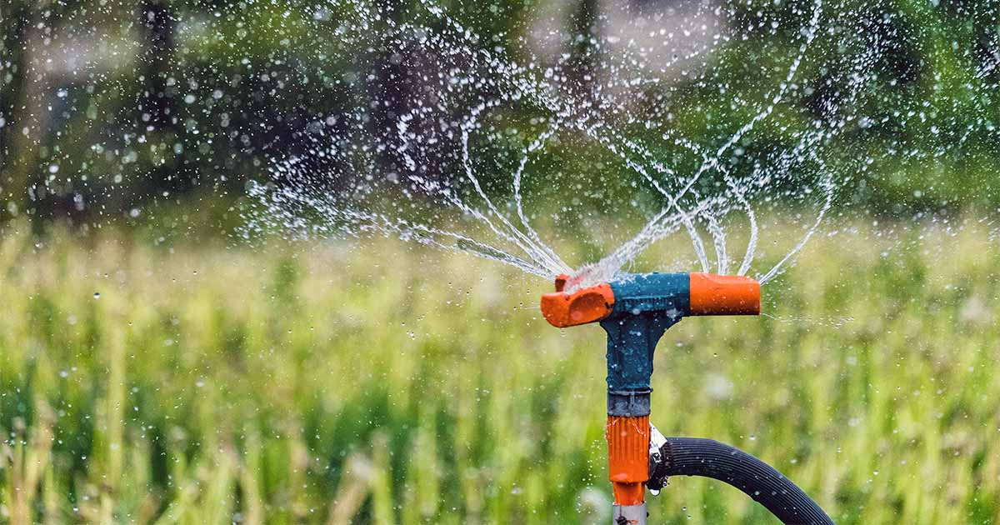
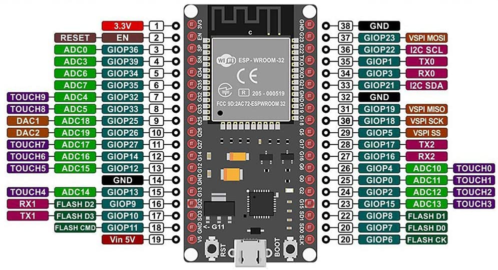
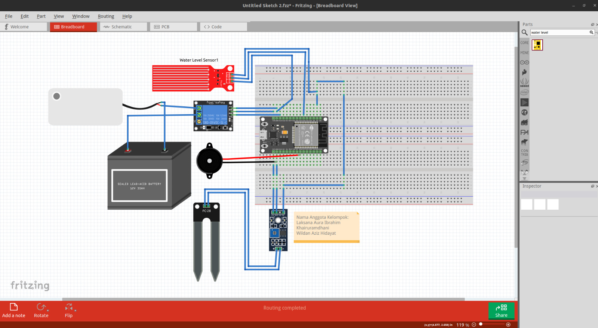

# Automatic Plant Watering System with ESP32, RTC, Water Level, and Soil Moisture Sensor

## Project Domain
The project focuses on IoT-based automation for efficient plant watering by integrating sensors and actuators with an ESP32 microcontroller.

### Problem Statements
- Manual plant watering can lead to inconsistent water supply, affecting plant growth.
- Overwatering or underwatering can harm plants, especially in urban or remote setups.
- Managing watering schedules manually is time-consuming and inefficient.

### Goals
- Automate the watering process for plants based on real-time soil moisture levels.
- Optimize water usage by ensuring precise and efficient irrigation.
- Provide a user-friendly system with clear feedback and notifications.

### Solution Statements
- Integrate a soil moisture sensor to monitor soil conditions.
- Use a water level sensor to ensure adequate water supply for the pump.
- Employ an RTC module to manage watering schedules precisely.
- Use an ESP32 microcontroller to control the system and display information on an OLED screen.
- Include a buzzer for alerts and a relay to activate the water pump.

## Prerequisites
### Component Preparation
- **ESP32**: Microcontroller for data processing and system control.
- **Soil Moisture Sensor YL-69**: Measures soil moisture levels to determine watering needs.
- **Water Level Sensor**: Monitors water levels in the reservoir.
- **RTC I2C Module**: Keeps track of time for scheduled watering.
- **Battery 7V 2000 mAh**: Powers the system.
- **Water Pump**: Delivers water to the plants.
- **Relay 5V**: Switches the water pump on or off.
- **Buzzer**: Provides audio alerts.
- **OLED 128x64 (Adafruit)**: Displays system status and sensor readings.

### Datasheet ESP32

### Schematic Fritzing

## Demo and Evaluation
- **Setup**: Connect all components as per the wiring diagram and upload the code to ESP32.
- **Demo**: Demonstrate real-time monitoring of soil moisture and water levels, along with automatic watering and notifications.
- **Evaluation**: Test the system under different soil conditions and evaluate water usage efficiency.

https://github.com/user-attachments/assets/9ddc3a71-bdd0-4ae9-9dad-f0930a42f8fc

## Conclusion
This project provides a cost-effective and efficient solution for automating plant irrigation. By leveraging IoT components like ESP32 and sensors, it ensures optimal water usage, reduces manual intervention, and supports plant health. The system can be further enhanced with smartphone integration or weather forecasting data for advanced functionality.
